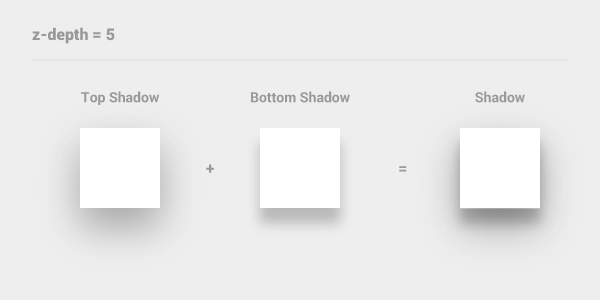
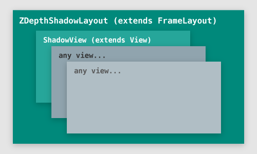

ZDepthShadowLayout
==================

Android - draw z-depth shadow of MaterialDesign

## Demo


## Screen Capture


## Download

```
apply plugin: 'com.android.application'

repositories {
    maven {
        url "https://jitpack.io"
    }
}

android {
    // something code...
}

dependencies {
    compile 'com.github.ShogoMizumoto:ZDepthShadowLayout:1.0.4'
}
```

## How to Use

```
<RelativeLayout
    xmlns:android="http://schemas.android.com/apk/res/android"
    xmlns:shadow="http://schemas.android.com/apk/res-auto"
    android:layout_width="match_parent"
    android:layout_height="match_parent">

    <app.mosn.zdepthshadowlayout.ZDepthShadowLayout
        android:layout_width="wrap_content"
        android:layout_height="wrap_content"
        shadow:z_depth="z_depth1"
        shadow:z_depth_shape="rect"
        shadow:z_depth_padding="z_depth5">

        <TextView
            android:layout_width="wrap_content"
            android:layout_height="wrap_content"
            android:text="Change ZDepth"
            android:background="@android:color/white"/>

    </app.mosn.zdepthshadowlayout.ZDepthShadowLayout>

</RelativeLayout>
```

### Attribute

#### configuration

```
<app.mosn.zdepthshadowlayout.ZDepthShadowLayout
    shadow:z_depth="z_depth1"         // enum
    shadow:z_depth_shape="rect"       // enum
    shadow:z_depth_padding="z_depth5" // enum
    shadow:z_depth_animDuration="150" // integer
    shadow:z_depth_doAnim="true"      // boolean
/>
```

#### attrs.xml

```
<resources>
    <declare-styleable name="ZDepthShadowLayout">
        <attr name="z_depth" format="enum">
            <enum name="z_depth0" value="0"/>
            <enum name="z_depth1" value="1"/>
            <enum name="z_depth2" value="2"/>
            <enum name="z_depth3" value="3"/>
            <enum name="z_depth4" value="4"/>
            <enum name="z_depth5" value="5"/>
        </attr>
        <attr name="z_depth_shape" format="enum">
            <enum name="rect" value="0"/>
            <enum name="oval" value="1"/>
        </attr>
        <attr name="z_depth_padding" format="enum">
            <enum name="z_depth0" value="0"/>
            <enum name="z_depth1" value="1"/>
            <enum name="z_depth2" value="2"/>
            <enum name="z_depth3" value="3"/>
            <enum name="z_depth4" value="4"/>
            <enum name="z_depth5" value="5"/>
        </attr>
        <attr name="z_depth_paddingLeft" format="enum">
            <enum name="z_depth0" value="0"/>
            <enum name="z_depth1" value="1"/>
            <enum name="z_depth2" value="2"/>
            <enum name="z_depth3" value="3"/>
            <enum name="z_depth4" value="4"/>
            <enum name="z_depth5" value="5"/>
        </attr>
        <attr name="z_depth_paddingTop" format="enum">
            <enum name="z_depth0" value="0"/>
            <enum name="z_depth1" value="1"/>
            <enum name="z_depth2" value="2"/>
            <enum name="z_depth3" value="3"/>
            <enum name="z_depth4" value="4"/>
            <enum name="z_depth5" value="5"/>
        </attr>
        <attr name="z_depth_paddingRight" format="enum">
            <enum name="z_depth0" value="0"/>
            <enum name="z_depth1" value="1"/>
            <enum name="z_depth2" value="2"/>
            <enum name="z_depth3" value="3"/>
            <enum name="z_depth4" value="4"/>
            <enum name="z_depth5" value="5"/>
        </attr>
        <attr name="z_depth_paddingBottom" format="enum">
            <enum name="z_depth0" value="0"/>
            <enum name="z_depth1" value="1"/>
            <enum name="z_depth2" value="2"/>
            <enum name="z_depth3" value="3"/>
            <enum name="z_depth4" value="4"/>
            <enum name="z_depth5" value="5"/>
        </attr>
        <attr name="z_depth_animDuration" format="integer"/>
        <attr name="z_depth_doAnim" format="boolean"/>
    </declare-styleable>
</resources>
```

## What is ZDepth?


#### Example : z-depth 5



### Outline



#### Example


## MIT License

This library is released under the MIT License, see LICENSE.txt.
